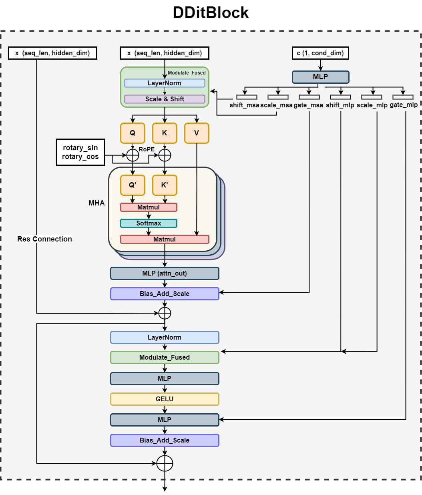

# Work Summary for Diffusion Language Model Accelerator

## Literature Survey
In this section, we will cover three main topics for the literature survey in diffusion language models.

- Traditional latent diffusion model
- Diffusion language model and diffusion transformers (DiTs)
- An edge FPGA accelerator for stable diffusion, [*SDA: Low-Bit Stable Diffusion Acceleration on Edge FPGAs*](https://www.sfu.ca/~zhenman/files/C41-FPL2024-SDA.pdf).

### Latent Diffusion Model in Vision

Diffusion models have been proven very successful in computer vision, such as image generation in image editing. Here, we introduce the widely adopted architecture of diffusion models in vision. In general, a diffusion model consists of a forward noising process and a reverse denoising process, as visualized below[1]. The figure below. The forward process gradually adds noises to data, while the reverse process learns to transform noise back to data. During diffusion inference, only the reverse denoising process is performed. In essence, we need to train a noise estimate network to learn the conditional distribution and predict noise at each time step, so as to recover $X_0$ from $X_T$.

A typical diffusion architecture in vision uses a combination of a **Text Encoder** (such as CLIP), a **Noise Estimate Network (NEN)** and **VAE(Variational Autoencoder)**. Typically, NEN using **U-Net** dominates diffusion models in vision. However, diffusion language models don't necessarily involve the U-Net architecture. Even if they do, the operators are not the same as diffusion models for vision, as will be discussed later. U-Net is used for progressive refinement via noise addition, and is considered as the most important part for hardware acceleration.

Specifically, U-Net in latent diffusion models mainly comprises **Res Blocks** and **Attention Blocks**. The encoder and decoder parts form a "U" shape. The **Res Blocks** are organized with layers including linear, 2D convolution, group norm and non-linear computations. In Attention Blocks, we mainly need to deal with matirx-matrix multiplication.

### Diffusion Language Models
While diffusion models dominates fields in AIGC for image, video or audios, how to construct diffusion language model is non-trivial due to the discrete nature of text as opposed to the continuous nature of other data types. Works on diffusion models for language generation remain limited, and there is also no specialized hardware accelerator for diffusion language models, either.

We consider two diffusion language models in this section:

- **MDLM** from [Simple and Effective Masked Diffusion Language Models](https://arxiv.org/abs/2406.07524)[2]

- **Diffusion-LM** from [Diffusion-LM Improves Controllable Text Generation](https://arxiv.org/abs/2205.14217)[3]

One approach transforms the discrete text information into continuous representation. In Diffusion-LM, instead of using the CLIP→U-Net→VAE architecture in vision, the model adopts an embedding function to map discrete text into continuous space, and also a rounding method to map embeddings back to texts. In the middle, these models adopt an encoder-decoder structure. However, it does not use ResNet blocks as seen in diffusion for vision tasks. Instead, Diffusion-LM leverages transformer-based architectures, such as BERT-style transformers, to handle sequential text data. [4] also exploits BART (Bidirectional and Auto-Regressive Transformers) and T5(Text-To-Text Transfer Transformer) as their pre-trained encoder-decoder network, as shown below.

Another approach is the use discrete diffusion, as is the case for **MDLM**. The U-Net backbone is replaced with Diffusion Transformers (DiTs for short). DiTs accept conditional inputs (diffusion timesteps) as well as noised input IDs. At each time step, the input IDs are passed through a vocab embedding layer to represent high-dimensional vectors, and the timestep, *t*, is also embedded as a vector. The embedded inputs and timesteps are processed through multiple **DDiTBlocks** and go into a final layer specific  to gradually denoise the inputs. A scheduler is utilized to manage the noise and its schedule, generating meaningful contents in the end. The following figure illustrates the overall architecture in MDLM.

A more detailed architecture for DDitBlock is as below. It accepts two inputs: input sequence of embeddings $x$, and the conditioning input $c$. $x$ remains the same dimension [seq_len, hidden_dim], rather than changing size as in autoregressive transformer models. Note that adaptive layer norm layers (adaLN) layer is utilized for $c$ prior to any residual connections within the block, allowing the block to adapt its behavior based on external timestep conditions. The rest part follows similar behavior in a common transformer block.

To summarize, diffusion language models adopt different (most likely transformer blocks) operators during denoising phase. Some adopts DiT rather than U-Net architecture, and achieves improved performance. Because MDLM is a state-of-the-art work that outperforms Diffusion-LM, and also follows a more reusable DiT architecture, we choose to implement MDLM in Allo. Currently, we are working on the DDitBlock, but we will move on to other components and achives an end-to-end implementation on FPGA.

### Hardware Acceleration for Diffusion

#### Architecture
We investigate existing works to realize the efficient hardware acceleration for diffusion models. *SDA: Low-Bit Stable Diffusion Acceleration on Edge FPGAs* [5], claims to be the first hardware accelerator for stable diffusion. It adopts 1) a unified computational array (systolic array) for convolution and matrix multiplication, and 2) a centralized module for non-linear operations. Its overal architecture of SDA is illustrated below.

Here, **Hybrid SA** is a specially designed systolic array to accelerate both convolution and matrix multiplication in Attention Blocks. It supports both output-stationary and weight-stationary dataflows, and support different quantization schemes with DSP packing. 

**Special Function Unit (SFU)** is the non-linear module with fine-grained pipeline, and is connected with Hybrid SA using Shared Tile Buffer.

#### Low-bit Quantization, Hybrid Dataflow switching and DSP Packing 
The work uses Quantization-Aware Training(QAT) and applies distinct scaling factors at each denoising step to preserve accuracy. It is able to reduce the weight to 4 bit without degrading the accuracy. For activation, they use 8-bit representation. Evaluation metrics including FID and CLIP score show good results of the quantization scheme. 

The work provides insights that two different dataflows are required by matrix multiplication and convolution. For **MM**, Softmax, LNorm, GeGLU requires a row of data as soon as possible, so output stationary is preferred, while for **Conv**, GNorm requires the first G channels as soon as possible so weight-stationary is better in this case. 

To further improves computation efficiency, the work packs up to 6 multiplications and 2 additions (4 W4A8 operations for convolution and 2 W4A8 operations for matrix multiplication). 

The important workflow of DSP packing and dataflow transitions is illustrated below.

Currently, our MDLM accelerator only supports float32. Inspired by SDA, we might also consider adopting quantization and DSP packing for improved resource efficiency and performance.

## GPU Side Profiling 
In this section, the profiling results on GPUs for both MDLM and Diffusion-LM will be demonstrated and analyized. We are specifically interested in their performance bottlenecks and operator types, which help us develop the accelerator in HLS. 

### Experimental Setup
In this study, we used the PyTorch Profiler and TensorBoard to analyze the performance of both MDLM and Diffusion-LM. The model backbones are manually extracted from their original project without the complexed front-end and back-end processing for better performance measurement. The batch size and timestep parameters are varied to observe their impact on model performance.

For simplicity, for the final bottleneck analysis, I choose batch_size=16, timestep=128(as recommened by the original project) for **MDLM**, and batch_size=1, timestep=20 for **Diffusion-LM** because of its low cuda utilization. MDLM is better supported by GPU.

### Profiling Analysis
#### MDLM
CPU Time: 5.708 seconds

CUDA Time: 4.940 seconds

Top cuda execution time lists is shown in the table.
| Name | CUDA Total | CPU Total% |
| --- | --- | --- |
| model_inference  | 4.578s | - |
| aten::linear | 3.834s | 21.53% |
| aten::addmm | 1.453s | 4.61% |
| bias_dropout_add_scale_fused | 897.167ms | 7.29% |
| aten::mul | 683.187ms | 2.76% |

The linear and matrix multiplication operations are critical components and likely form the bottleneck.These are likely tied to the fully connected layers and attention computation particularly in the transformer blocks. 

The GPU utilization is very high for MDLM. The majority of the execution time is spent in the Kernel operation, as desired.

The operator view also shows that the linear computations as in linear projection and fully connected layer, as well as the attention mechanism is likely the system bottleneck. Note that the memory operations that copy data between different memory locations and convert tensors between CPUs and GPUs are neccessary in our system, but causes extra memory overhead.

The module view aligns with our expectation for how the model would operate.

#### Diffusion-LM
Diffusion-LM is operated entirely on CPU for better analysis as it seems to have a poor cuda utilization rate.

Again, **aten::linear** and **aten::addmm** are the most significant, consuming the majority of total time. Layer norm and batch matrix multiplication are also relatively prominent.

#### Conclusion
While the two models initially appears distinct in their design and model structure, the profiling and analysis reveals good similarities in their computational matter. By focusing on their shared operators, especially the GEMM and GEMV computations from linear layers and attention computations, we could use optimized Allo systolic arrays to support both models. For our current target, we choose to focus on MDLM, as it has more regular structure and offers better performance. 

## Project Development
### Current Status
We have successfully extracted the backbones for both MDLM and Diffusion-LM, which are crucial for the next steps in hardware acceleration. The Numpy version of the MDLM DDiTBlock has been verified against the original PyTorch implementation to confirm the functional equivalence. For our Allo implementation, we have passed LLVM and csim verifications. 

### Tasks Underway
- C-RTL Co-Simulation and On-board Test
- Resource Optimization (Unable to fit on-chip due to large DRAM demand)
- Code and Architecture Refinement
- Other MDLM Components Development

## References
[1] Croitoru F A, Hondru V, Ionescu R T, et al. Diffusion models in vision: A survey[J]. IEEE Transactions on Pattern Analysis and Machine Intelligence, 2023, 45(9): 10850-10869.

[2] Sahoo S S, Arriola M, Schiff Y, et al. Simple and Effective Masked Diffusion Language Models[J]. arXiv preprint arXiv:2406.07524, 2024.

[3] Li X, Thickstun J, Gulrajani I, et al. Diffusion-lm improves controllable text generation[J]. Advances in Neural Information Processing Systems, 2022, 35: 4328-4343.

[4] Lovelace J, Kishore V, Wan C, et al. Latent diffusion for language generation[J]. Advances in Neural Information Processing Systems, 2024, 36.

[5] Yang G, Xie Y, Xue Z J, et al. SDA: Low-Bit Stable Diffusion Acceleration on Edge FPGAs[J].