# Diffusion Language Model Accelerator Implementation

This document provides details of the acceleration of diffusion language model using **Allo**. It explores both GPU-side profiling and hardware optimization strategies to improve computational efficiency for both **Masked Diffusion Language Models (MDLM)** and **Diffusion-LM**. First, we conduct performance profiling on GPUs to identify basic operators and systemcomputational bottlenecks, focusing on matrix multiplications (GEMM/GEMV) and attention mechanisms. Next, we leverage the **Roofline Model** to assess whether MDLM computations are memory-bound or compute-bound on the target FPGA platform. This analysis informs our hardware design decisions, leading to optimizations such as memory consumption, systolic array reuse, and custom scheduling. Finally, we discuss current development progress, compare the key performance improvements between the baseline and optimized implementations, and provide suggestions for improving the Allo framework to enhance automatic HLS-based accelerator generation.

## GPU Side Profiling 
In this section, the profiling results on GPUs for both MDLM and Diffusion-LM will be demonstrated and analyized. We are specifically interested in their performance bottlenecks and operator types, which help us develop the accelerator in HLS. 

### Experimental Setup
In this study, we used the PyTorch Profiler and TensorBoard to analyze the performance of both MDLM and Diffusion-LM. The model backbones are manually extracted from their original project without the complexed front-end and back-end processing for better performance measurement. The batch size and timestep parameters are varied to observe their impact on model performance.

For simplicity, for the final bottleneck analysis, I choose batch_size=16, timestep=128(as recommened by the original project) for **MDLM**, and batch_size=1, timestep=20 for **Diffusion-LM** because of its low cuda utilization. MDLM is better supported by GPU.

### Profiling Analysis
#### **MDLM**
**CPU Time:** 5.708 seconds

**CUDA Time:** 4.940 seconds

Top cuda execution time lists is shown in the table.
| Name | CUDA Total | CPU Total% |
| --- | --- | --- |
| model_inference  | 4.578s | - |
| aten::linear | 3.834s | 21.53% |
| aten::addmm | 1.453s | 4.61% |
| bias_dropout_add_scale_fused | 897.167ms | 7.29% |
| aten::mul | 683.187ms | 2.76% |

The linear and matrix multiplication operations are critical components and likely form the bottleneck.These are likely tied to the fully connected layers and attention computation particularly in the transformer blocks. 

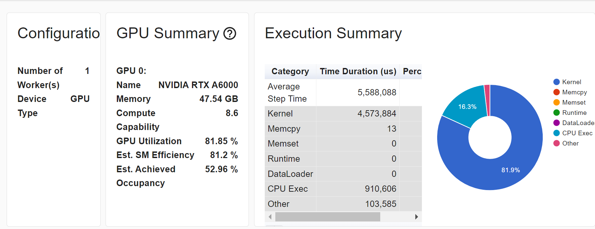

*Figure 1: Overall GPU utilization, execution time distribution, and efficiency of MDLM.*

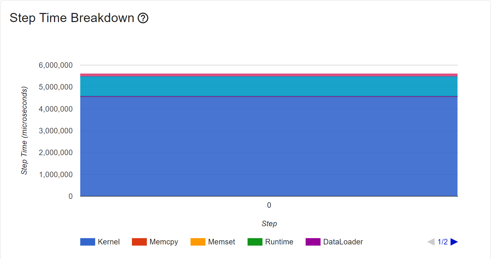

*Figure 2: Step time breakdown showing the majority of execution time in GPU kernel operations of MDLM.*

The GPU utilization is very high for MDLM. The majority of the execution time is spent in the Kernel operation, as desired.

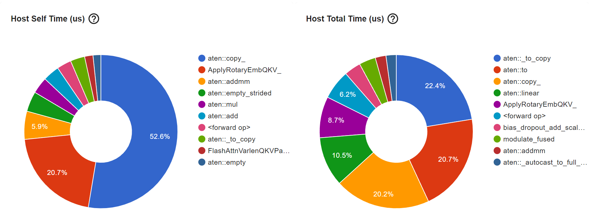
*Figure 3: MDLM Host self time and host total time breakdown.*

The operator view also shows that the linear computations as in linear projection and fully connected layer, as well as the attention mechanism is likely the system bottleneck. Note that the memory operations that copy data between different memory locations and convert tensors between CPUs and GPUs are neccessary in our system, but causes extra memory overhead.

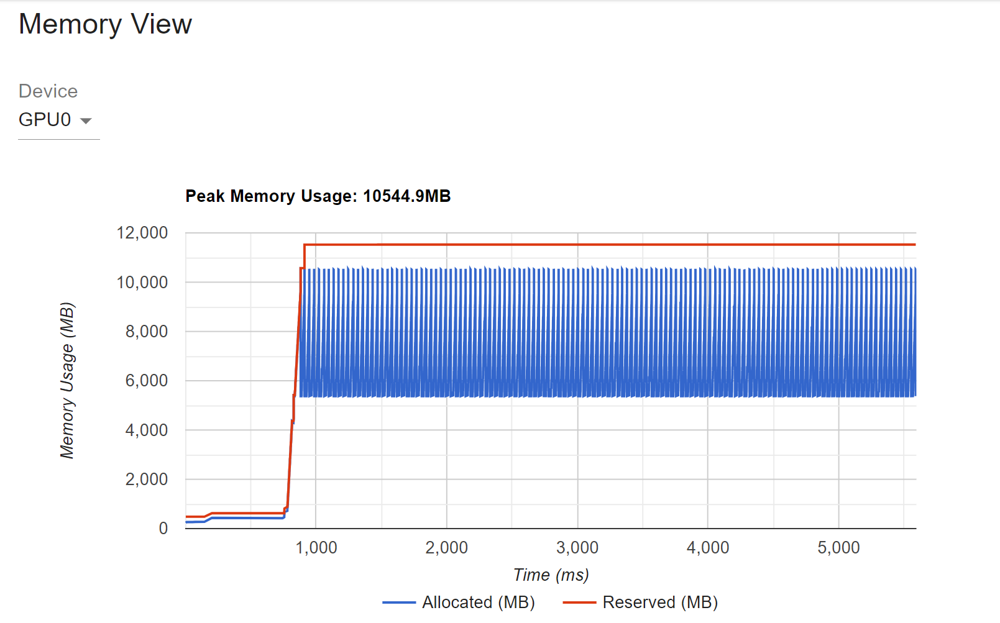

*Figre 4: MDLM inference GPU peak memory usage over time.*

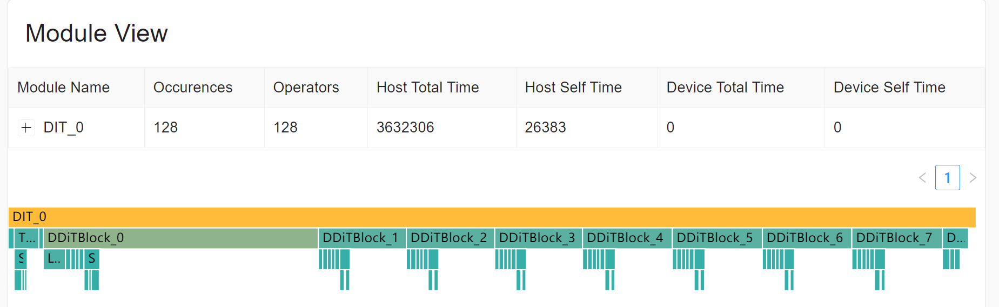

*Figure 5: Module execution view of DDitBlock.*

The module view aligns with our expectation for how the model would operate.

#### **Diffusion-LM**
Diffusion-LM is operated entirely on CPU for better analysis as it seems to have a poor cuda utilization rate.

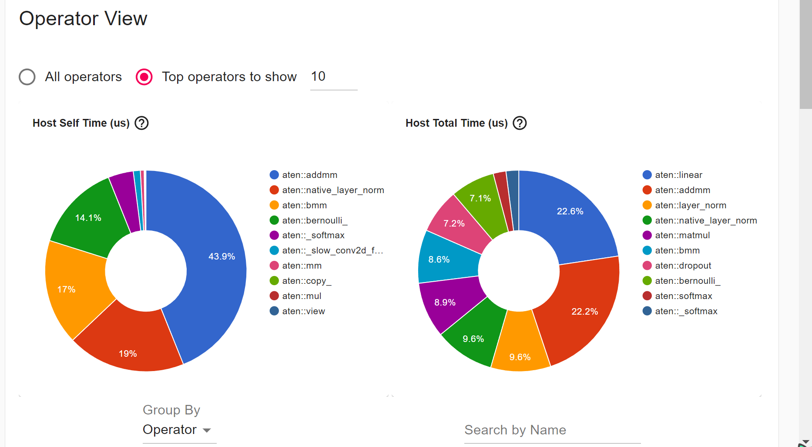

*Figure 6: Step time breakdown of Diffusion-LM.*

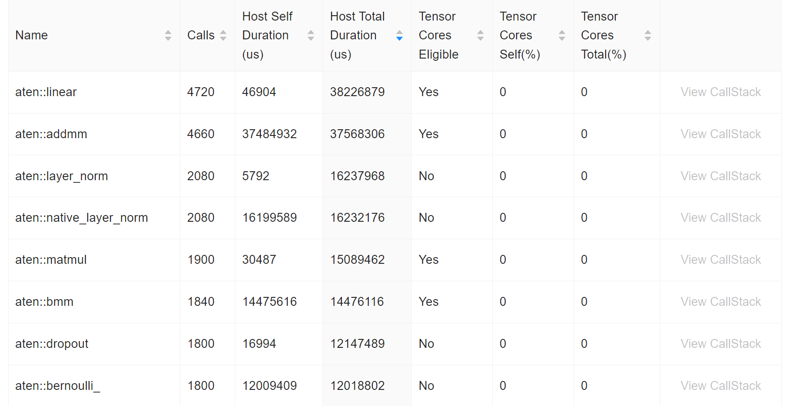

*Figure 7: aten::linear and aten::addmm consume the majority of time in Diffusion-LM.*

Again, **aten::linear** and **aten::addmm** are the most significant, consuming the majority of total time. Layer norm and batch matrix multiplication are also relatively prominent.

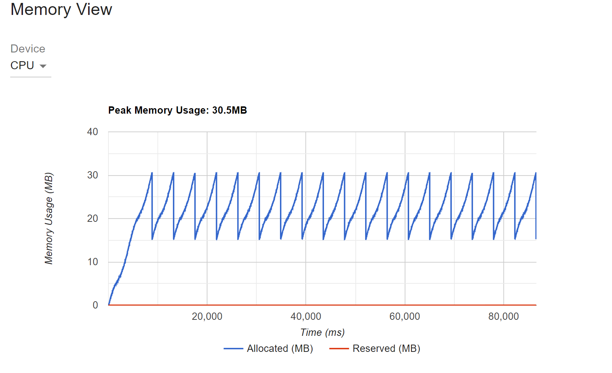

*Figure 8: Diffusion-LM inference GPU peak memory usage over time.*

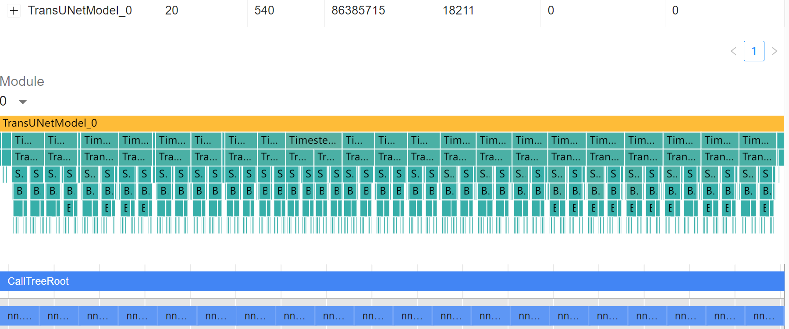

*Figure 9: Module execution view of Diffusion-LM.*

#### Conclusion
While the two models initially appears distinct in their design and model structure, the profiling and analysis reveals good similarities in their computational matter. By focusing on their shared operators, especially the GEMM and GEMV computations from linear layers and attention computations, we could use optimized Allo systolic arrays to support both models. For our current target, we choose to focus on MDLM, as it has more regular structure and offers better performance. 

## Roofline Model Analysis
The **Roofline Model** helps analyze the performance of computational workloads by comparing the **number of floating-point operations (FLOPs)** to the available **memory bandwidth** in a system. The performance is determined by the minimum of the **peak throughput (Peak_FLOPS)** and the available memory bandwidth multiplied by the **operation intensity (OI)**. The relationship could be modeled as:

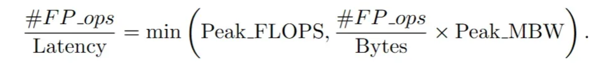*

Where:
- **\#FP_ops** represents the total number of floating-point operations.
- **Latency** is the computational latency of the operations.
- **Peak_FLOPS** is the system's peak floating-point operations per second.
- **Peak_MBW** is the peak memory bandwidth.
- **OI** is defined as the ratio of **\#FP_ops** to **\#Bytes**. It indicates how many floating-point operations are performed for each byte of data transferred.

The performance of the system is determined by comparing the **Peak_FLOPS** (computational capacity) and **\#FP_ops / \#Bytes × Peak_MBW**. As shown in the figure below, a system is considered **memory-bound** if OI is less than the turning point. Otherwise it is **computation-bound** when OI exceeds the turning point.

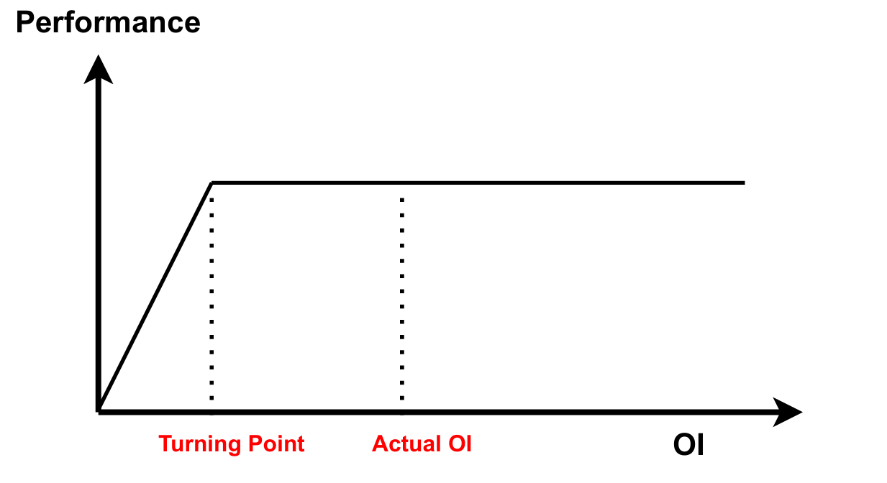

*Figure 10: Roofline model representation showing the relationship between operational intensity (OI) and performance.

### Performance Evaluation
For the DDitBlock featuring sequential computations through various operators, The total **FLOPs** for each step are modeled as below. Specifically, all the GEMM computations are supported by output-stationary styled systolic arrays.

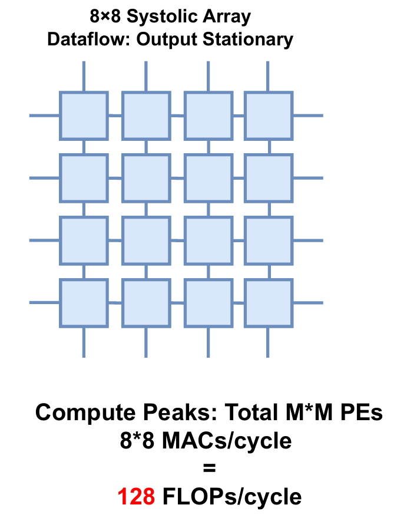

*Figure 11: Allo systolic array roofline analysis.*

Example analysis is as below:
- **Step 1: adaLN_modulate**
  - FLOPs = 128 * 3072 * 2
  - This step uses a systolic array with 1x8 **PEs**.

- **Step 2: Modulate_fused**
  - **LayerNorm**: 8 * 1024 * 512 FLOPs
  - **Scale**: 3 * 1024 * 512 FLOPs

- **Step 3: Q, K, V**
  - FLOPs = 1024 * 512 * 512 * 2 * 3
  - This step is computed with a systolic array of 8x8 PEs (can be reused).

  Finally, the **Total FLOPs** is determined as 5.39 GFLOPs, the **Off-chip Memory Access** is approximately 0.014 GB, so **OI** is calculated as 385 FLOPs/Byte. The performance peak achieved by the proposed architecture is 211 GFLOPS. Consider the **Memory Bandwidth**, HBM is 480 GB/s, while DRAM implementation is 38 GB/s according to the U280 datasheet. Therefore, the turning points for HBM is 0.43 FLOPs/Byte, and For DRAM 5.55 GFLOPS/Byte. Either way, The kernel is **computation-bound**, meaning the performance is limited by the compute throughput rather than memory bandwidth on the target FPGA.

## Project Development

### Current Status
We have successfully extracted the backbones for both MDLM and Diffusion-LM, which are crucial for the next steps in hardware acceleration. The Numpy version of the MDLM DDiTBlock has been verified against the original PyTorch implementation to confirm the functional equivalence. For the kernel implementations, we present two versions of the DDitBlock, one autogerated by Allo. However, the large on-chip BRAM usage (more than 900%) makes it unrealistic to directly deploy the baseline on-board. Therefore, we utilized several techniques and improved the HLS code, and the optimized code is able to fit on-chip with reduced latency. 

### CSim Results
We verified the CSim results of DDitBlock kernel against the numpy version, both using 32-bit floating point precision. The following table shows the Mean Absolute Error (MAE) and Mean Squared Error(MSE) metric, indicating a good alignment. -->

| **Metric** | **Value**     |
|------------|---------------|
| MAE        | 4.58 × 10⁻⁵   |
| MSE        | 5.073 × 10⁻¹² |

### Tasks Underway
- On-board Tests and End-to-end deployment on FPGA
- Other MDLM Components Development
- Roofline Model Analysis for the Optimized Version

### Performance Comparison

The following table summarizes the performance and estimated resources from both versions. The targeted frequency is set as 100 MHz. It could be observed that the original baseline consumes more than 910% percent of BRAM, making direct FPGA deployment unfeasible. In addition, instead of directly assigning each GEMM operators distinct systolic arrays, we reuse systolic arrays that share the same tensor shape in diffusion inference(For instance, MLP1 and MLP2 during FFN utilize the same systolic arrays). This further reduces the computation resources like DSPs and LUTs.

| **Version**   | **Latency (ns)** | **BRAM**    | **DSP**    | **FF**      | **LUT**      | **URAM**    |
|---------------|------------------|-------------|------------|-------------|--------------|-------------|
| **Baseline**  |  5.1E9           | 36693 (910%) | 2791 (30%) | 273231 (11%)| 369770 (28%) | -           |
| **Optimized** | 4.127E9          | 1532 (37%)  | 1186 (13%) | 126044 (4%) | 170984 (13%) | 768 (80%)   |


### Optimization Techniques

To address the limitations of the Baseline Version, several optimizations were implemented to reduce memory usage, improve computation efficiency, and enable on-chip deployment. The key improvements are as follows:

**BRAM Optimization and Memory Reduction**
- In the Baseline, Allo tends to copy input data on-chip all at once before initiating computations. A redundant memory copy behavior is evident. The issue lies in the fact that Allo allocates memory for the entire data upfront, even when not all of it is required. To improve memory efficiency. To avoid excessive BRAM usage, the optimized version fetch the necessary data on-chip only when needed. 

- In addition, we also reuse and reallocate buffers to further reduce RAM usage. For instance, instead of storing separate copies of intermediate tensors, we introduce four key buffers—`buffer_Q`, `buffer_K`, `buffer_V`, and `buffer_x`—to store both input and intermediate results. Multiple buffers holding similar or overlapping data are merged, reducing memory fragmentation and avoiding redundant memory usage.

- Utilizing URAM for large tensors: The Alveo U280 FPGA features abundant URAM resources with higher capacity. To take advantage of this, we bind large buffers to URAM using the following directive:

```
#pragma HLS bind_storage variable=target_variable type=ram_2p impl=uram
```

to offload pressure from solely BRAM.

**Breaking Down Large Tensors in AdaLN**

- Origianlly, the code stores large tensors ([128, 3072]) for AdaLN parameters, which led to excessive memory allocation. Instead of storing AdaLN parameters as a large [128, 3072] tensor, we split it into six [128, 512] blocks, corresponding to each transformation, and calls adaLN computations without changing its functionality.

**Reducing Intermediate and Output Storage**

- The original implementation tends to creat separate buffers for intermediate values. For instance, in the multi-head attention computation (`scaled_dot_product_attention`), values like `Y_t` and `C_h` could be directly stored in existing tensors, but Allo still duplicates the storage. To tackle the issue, we eliminated redundant buffers by writing results directly into reused storage, and removes unnecessary memory allocations when they could be reused. This drastically removes several large tensors sized [1024, 1024] amd [1024, 512], which causes large BRAM usage.

**Reusing Systolic Arrays for GEMM Operations**

- The baseline implementation allocated separate systolic arrays for every GEMM operation, even when the matrix dimensions were identical. This increased DSP and LUT usage, leading to unnecessary hardware resource consumption. On the contrary, we reused systolic arrays for GEMM operations with the same tensor dimensions.

## Allo Feature Suggestions
The project is developed with a combined efforts of the Allo framework and mannual HLS optimizations. Allo enables fast accelerator construction and verifications, and also provides access to developers with less hardware implementations experiences. However, when dealing with large-sized model, the HLS accelerator generated by Allo almost always cannot be directly fit on-chip. It also lacks a more fine-grained control from the user's perspective. 

### Redundant Memory Copy
As discussed previously, Allo copies all input data to BRAM upfront before computation begins, even when only a portion of the data is needed. It could be useful to introduce a more efficient memory manage strategy. For instance, if the framework could identifies when the data is needed and fetch from DRAM, or target reusable buffers, it could eliminate redundant memory allocations overhead and enable on-the-fly computations more efficiently.

### Custom Scheduling
The current DDitBlock kernel is implemented using dsl.grid and a systolic array-based inner product dataflow. The design follows a sequential execution, where multiple GEMM operations from attention and feed forward calculations are processed tile-by-tile sequentailly. While the implementation is straightforward and easy to verify, the current implementation suffers from excessive BRAM usage and limited scalabilty, making it difficult to achieve further performance improvements both mannually or on the Allo side. Without adopting dataflow architecture, however, even the smallest model could not fit on-chip for the Baseline. We have tested mannual tiling following similar logics. 

```

# Mannual Tiling in top function follows similar logics
def systolic[
    TyA, TyB, TyC, M: int32, K: int32, N: int32, Mt: int32, Nt: int32
](A: "TyA[M, K]", B: "TyB[K, N]", C: "TyC[M, N]") -> "Ty[M, N]":
    local_A: TyA[Mt, K]
    local_B: TyB[K, Nt]
    local_C: TyC[Mt, Nt]

    # k needs not be tiled, since it is temporal dimension
    for mi, ni in dsl.grid(M // Mt, N // Nt, name="outer_tile"):
        # reversed traversal, better for cascading systolic arrays with FIFOs
        # corresponds to the order of the previous `store_C_tile` output
        for ak, ai in dsl.grid(K, Mt, name="load_A_tile"):
            # reuse along the ni dimension
            if ni == 0:
                local_A[ai, ak] = A[mi * Mt + ai, ak]
        for bk, bj in dsl.grid(K, Nt, name="load_B_tile"):
            # reuse along the mi dimension
            # since the inner access order is different from the outer one,
            # we cannot cache as a line buffer
            local_B[bk, bj] = B[bk, ni * Nt + bj]
        systolic_tile[TyA, TyB, TyC, K, Mt, Nt](
            local_A,
            local_B,
            local_C,
        )
        # reversed traversal, better for cascading systolic arrays with FIFOs
        for sj, si in dsl.grid(Nt, Mt, name="store_C_tile"):
            C[mi * Mt + si, ni * Nt + sj] = local_C[si, sj]
        return C
```

However, it is hard to specify the composition and schedules, leading to some errors like incorrect indexing in the HLS code.

### More Efficient Streaming

Currently, more dataflows are expected to be supported in the improved framework, not limited to inner product, output stationary manner. It should also be beneficial to experiment with a dataflow-based streaming architecture that leverages streaming FIFOs and replace static BRAM allocation. In Allo, the streaming FIFOs are implmented as pipes (`df.pipe`), which enable data streaming between different components without explicit memory access. 

For instance, for the streaming FIFO example below, a producer kernel generates data and pushes it into a streaming FIFO, and a consumer retrieves the data for computation, just as the mannual organization in HLS. Here, the producer kernel reads elements from matrix A and streams them into a pipe. The consumer kernel retrieves each elements and adds 1, storing the results in matrix B. Allo also compiles the dataflow into MLIR, and we could see how the streaming mechanism is defined at a hardware level.

```
import allo
from allo.ir.types import float32, Stream
import allo.dataflow as df
import numpy as np

Ty = float32
M, N, K = 16, 16, 16

@df.kernel(mapping=[1])
def producer(A: Ty[M, N]):
    pipe: Stream[Ty] = df.pipe(src="producer", dst="consumer")
    for i, j in allo.grid(M, N):
        # load data
        out: Ty = A[i, j]
        # send data
        pipe.put(out)

@df.kernel(mapping=[1])
def consumer(B: Ty[M, N]):
    pipe: Stream[Ty] = df.pipe(src="producer", dst="consumer")
    for i, j in allo.grid(M, N):
        # receive data
        data = pipe.get()
        # computation
        B[i, j] = data + 1

A = np.random.rand(M, N).astype(np.float32)
B = np.zeros((M, N), dtype=np.float32)
top = df.build([producer, consumer])
top(A, B)
np.testing.assert_allclose(A + 1, B)
print("Passed!")
```

The GEMM could also be supported with multiple levels of streaming FIFOs. The input data will be read into HLS streams from off-chip, thus decoupling array size from the input dimensions. Additionally, multiple operators can also be connected through FIFOs, as comparable to "operator fusion". However, to support large and complexed model deployment, such as the entire diffusion transformer block, it is very challenging to ensure that the data flows between operators with correct functionality.

Through a smarter memory management and buffer reuse, combined with flexible dataflow support, these enhancement could make Allo more scalable and user-friendly with less mannual intervention.

