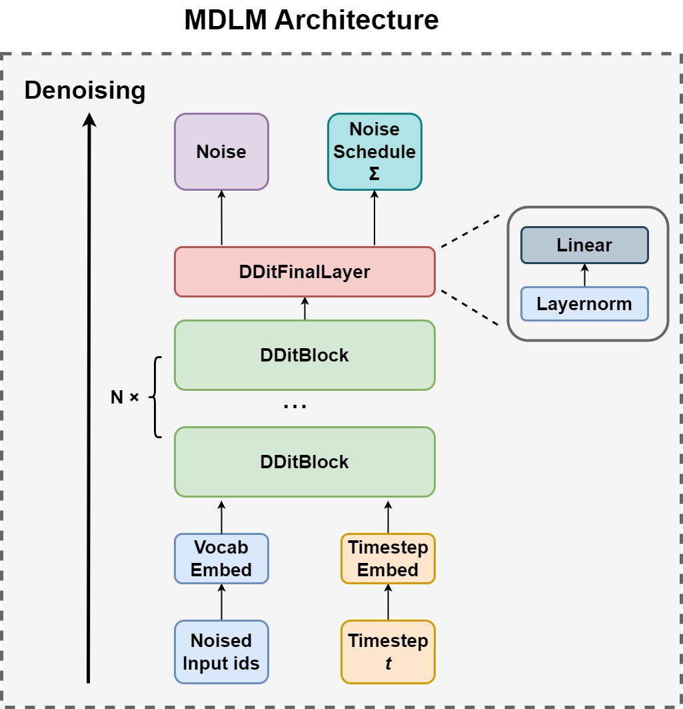
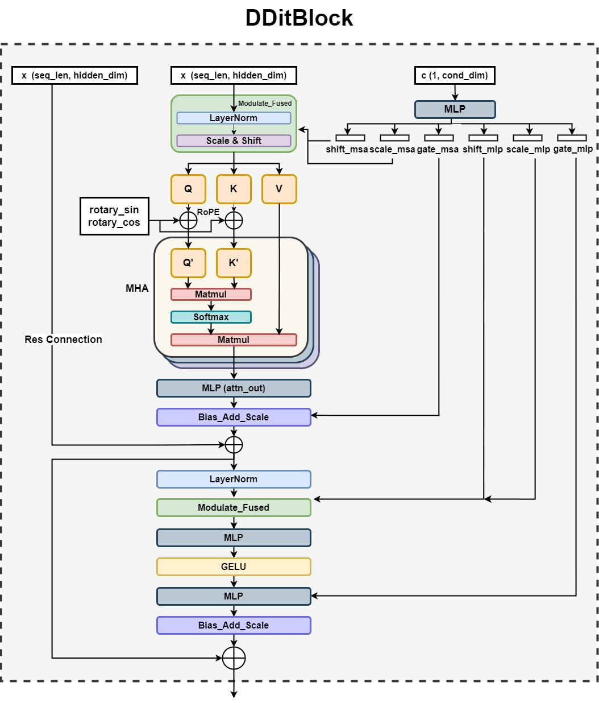

# FPGA-based Accelerator for Diffusion Language Models
Welcome to the open-sourced repository for our FPGA-based MDLM (Masked Diffusion Language Model) Accelerator built within the Allo framework!
## Overview
This ongoing project focuses on developing an efficient end-to-end accelerator for **diffusion language models** on FPGAs using the [**Allo**](https://arxiv.org/abs/2404.04815) framework and **High Level Synthesis (HLS)**. Allo is a accelerator design language (ADL) for efficient spatial accelerator design. The specific diffusion language model is based on [**Simple and Effective Masked Diffusion Language Models**](https://arxiv.org/abs/2406.07524). 

## Documentation
For more detailed information about the background and preliminary of diffusion mechanism, diffusion language model and our implementation, please refer to the following document:

- [project document](documentation/doc.md)

## MDLM Model
### Model Architecture
The following figure shows the overall architecture of the diffusion language model based on Diffusion Transformers (DiTs).

Specifically, we are currently developing the core DDitBlock components.

### Model Implementation
We have successfully implemented **DDitBlock**, the core Component of the DiT model in Allo, with succssful LLVM and CSim verifications. The C-RTL co-simulation and on-board deployment are to be tested in the future. We also plan to reduce the hardware overhead and develop other components in MDLM. Ultimately, we aim to deploy an end-to-end MDLM model on FPGA.

## How to Use
Clone this project and swtich to the main path.

To be able to generate HLS code, you need to have allo (https://github.com/cornell-zhang/allo) installed in your local environment. Go to `path_to_your_allo_project/allo/library/nn.py`, replace `nn.py` with `allo_code/allo_lib/nn.py` in our project, which is an updated library file with specialized DiT operators.

Next, run `python DDitBlock_Allo_Kernel.py`, which will automatically generate the HLS project. We also provide a pre-built project `Allo_DDitBlcok.prj`.

## Implementation
### FPGA Experimental Setup
For our hardware-side tests, all experiments are conducted on the **AMD Alveo U280 FPGA** using **Vitis v2022.1**, currently with a target frequency of 100MHz. The U280 FPGA is equipped with 4032 BRAM 18K blocks, 9024 DSP slices, 2.6M flip-flops, 1.3M LUTs, and 960 URAM blocks.

### CSim Results
We verified the CSim results of DDitBlock kernel against the numpy version in float32. The following table shows the Mean Absolute Error (MAE) and Mean Squared Error(MSE) metric, indicating a good alignment.

| **Metric** | **Value**     |
|------------|---------------|
| MAE        | 4.58 × 10⁻⁵   |
| MSE        | 5.073 × 10⁻¹² |

### Synthesis Results
The table below shows the hardware resource and performance estimate at 100MHz.

## Developers and Contact Information
This project is currently in progress and developed by **Shuyang Li** (shuyanglee10008@gmail.com)

Under the guidance of **Professor Zhiru Zhang** and Ph.D. student **Yixiao Du** hwne interning at **Cornell University**. Should you have any questions, please feel free to contact Shuyang via e-mail.

